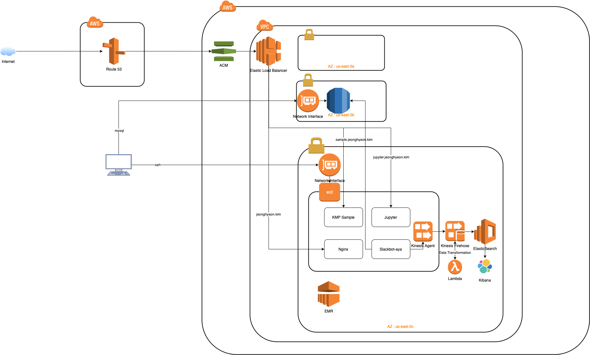

# Structure

## free-trial
1. create ec2 instance with bootstrap
   - [bootstrap.sh](ec2/bootstrap.sh)
   - security group 80 port for Load balancer's security group only 
2. Install WhaTap

## paid
3. create Application Load Balancer with listener, Target group (it's out of freetrial)
   - listener
     - 80 port: redirect to 443
     - 443 port: forward to target group
   - target group
     - 80 port
   - security group
     - open 80, 443 port for all
4. create ACM
   - add CNAME on Route53
5. Route53 redirect to Application Load Balancer

# Study
- [x] [Toolkit](toolkit/README.md)
- [x] [SAM](sam/README.md)
- [x] [Cloud Formation](cloudformation/README.md)
- [x] [Kinesis](kinesis/README.md)
- [x] [Amazon Rekognition](https://docs.aws.amazon.com/rekognition/index.html)
  - [x] [Detecting text in an image](https://docs.aws.amazon.com/rekognition/latest/dg/text-detecting-text-procedure.html)
- [ ] [AWS Data Pipeline](https://aws.amazon.com/ko/datapipeline/)
  - Scheduling available