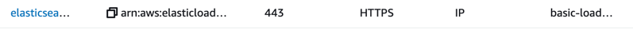

- 키바나가 기본적으로, public하게 open되어 있지 않음
- password방식과, vpn으로 접근 방식. 두가지 방식을 택할 수 있음
- password방식은 freetier에서 안됨.
- vpn도 유지하려면 돈듬
- 그래서, vpn방식은 결국, 같은 subnet에서 접속하면 가능하므로,ELB target group을 생성하여, ip forwarding해서 해결함
    - target type : ip address
    - https : 443 설정
    - 
    - [public 접속 처리하면서 발생한 이슈 처리 과정](access-es-public.md)