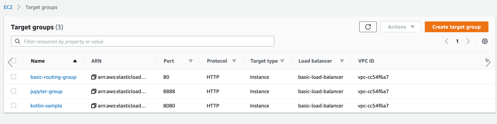

# Elastic Load Balancing

## 리스너 규칙
- http는 https 로 리다이렉트 되게 한다
- https내에서 각 서브 도메인 별 분기처리한다
- 각 서비스 별, 대상 그룹을 만들기. 한 ec2인스턴스에 포트만 다르다면, 대상에 포트 설정해주기(커스텀 포트나 기본 80포트, 443은 하지말것, https는 로드밸런스에서 관리함)
- ec2 인스턴스는 public하게 접근 못하게 하고, 로드 밸런스를 통해서만 접근 가능하게 해야함 자세한건 보안 그룹 참조

각 대상에는 network interface가 있어서, public ip가 존재한다.
그래서 jeonghyeon.kim이라는 도메인 명으로만 접근가능하게 하기 위해, 마지막 규칙에 404에러를 반환하게 처리한다.

## 대상 그룹
- 로드 밸런서에서 규칙을 추가할 때, 같은 VPC안의 대상그룹만 추가할 수 있음.
- 대상 그룹 생성시, IP adress로 추가할 수 있는데, 여기에서 같은 VPC의 private ip address로 설정할 수 있음

- 하나의 로드 밸런서에 3개의 network interface 가 생성되고, 각각에public ip가 존재한다.
- subnet ID도 3개 생성되고, VPC하나에 존재.
- us-east-2a,b,c 영역에 각각 존재하는데, 왜 a,b,c에 각각 하나씩 있어야하는지는 잘 모르겟음
