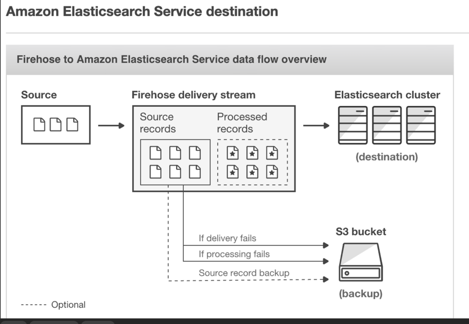
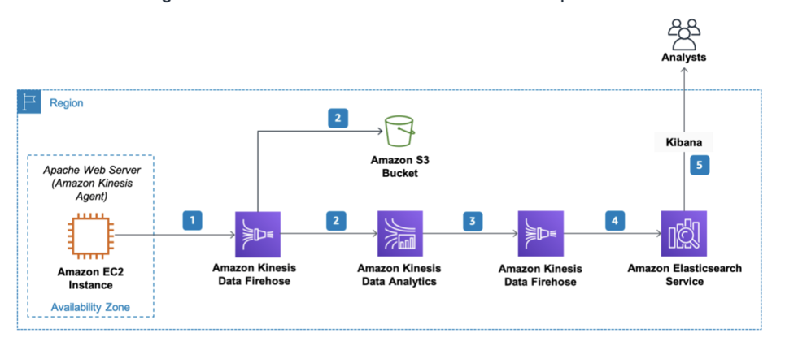

[Kinesis Agent](kinesis-agent.md)

# AWS Kinesis

## Kinesis Data stream
데이터의 커스텀 처리가 필요할 경우 사용

## Kinesis Firehose
- 수집된 데이터를 단순히 S3, Redshift, ElasticSearch등에 저장할 때 사용
- 단순 데이터 수집하여 활용시에 사용되며, 샤드 유지 비용이 들지 않고, 수집되는 데이터에 따라서만 요금이 지불된다
- Lambda를 통해, Transform이 가능함.
- Glue에 정의된 스키마로 변환 가능
    - Parquet등의 포맷 변환도 가능




## Kinesis Data stream과 Kinesis Firehose 의 차이점
```
With Kinesis Streams, you build applications using the Kinesis Producer Library put the data into a stream and then process it with an application that uses the Kinesis Client Library and with Kinesis Connector Library send the processed data to S3, Redshift, DynamoDB etc.

With Kinesis Firehose it’s a bit simpler where you create the delivery stream and send the data to S3, Redshift or ElasticSearch (using the Kinesis Agent or API) directly and storing it in those services.

Kinesis Streams on the other hand can store the data for up to 7 days. Which is why is leans towards to Domain 2.0: Storage.

You may use Kinesis Streams if you want to do some custom processing with streaming data. With Kinesis Firehose you are simply ingesting it into S3, Redshift or ElasticSearch.
```

## Tutorial
https://d1.awsstatic.com/Projects/P4113850/aws-projects_build-log-analytics-solution-on-aws.pdf



- file path가 ec2-user에 있으면, 인식을 못함
-  전송할 EC2에 Firehose에 접근할 권한을 줘야함
    - AmazonKinesisFirehoseFullAccess
    - CloudWatchFullAccess (cloudWatch에도 로그 전송)

Agent configuration

https://docs.aws.amazon.com/firehose/latest/dev/writing-with-agents.html#config-start

Data Transformation with Lambda
- https://docs.aws.amazon.com/firehose/latest/dev/data-transformation.html
- Base64로 인코딩 됨(하지만, 가끔식 인코딩 안한 상태로 데이터를 받음...)
- sam/firebose-log 폴더 참조
```
function atob(data) {
    try {
        
        let buff = Buffer.from(data, 'base64');
        return buff.toString('utf-8');
    } catch(e) {
        //sometimes receive data without base64 encoding
        return data
    }
    
}

//Base64 encoding
function btoa(data) {
    let buff = Buffer.from(data);
    return buff.toString('base64');
}
```