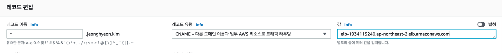
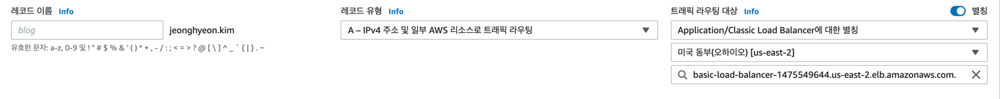
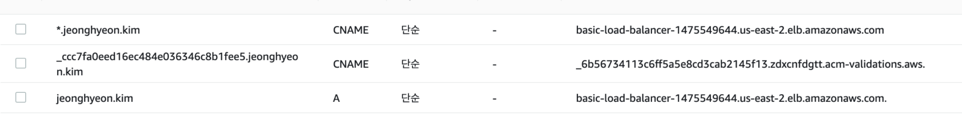

#Route53

## 레코드 유형
###cname
라우팅을 다른 도메인 네임을 설정할 때
- ELB 로 redirection

### a
라우팅을 ip address로 할 때
- alias : AWS의 리소스인 경우, 별칭을 선택가능
- 레코드 이름을 없애면, jeonghyeon.kim 처럼. sub 도메인이 없는 경우를 처리할 수 있다.

- 포트는 route53에서 처리할 수 없다.

## 권장 방식(?)
- sub domain 이 붙는 경우와 sub domain이 없는 경우를 별도로 처리할 수 없다.
- subdomain이 있는 경우 : CNAME으로 , load balancer 의 도메인으로 이동시킴
- sub domain이 없는 경우 : Address로 설정하고, alias를 load balancer의 dns명으로 설정해줌(cname으로 하면 에러남)
- 포트 포워딩방법
    - 로드밸런서에서 listener의 조건에 host header로 subdomain을 체크해서 대상그룹을 지정하고, 대상그룹은 각각 포트를 다르게 설정함.
- route 53은 로드 밸런스로만 이동시키고, 로드 밸런스는 각 요청 호스트별, 분기 처리 및 https인증만 하고, 각 ec2인스턴스는 서비스만 올려놓으면 됨
- ec2인스턴스에서 호스트별 분기처리를 몰라도 돼서, 상호간의 의존성이 없음
