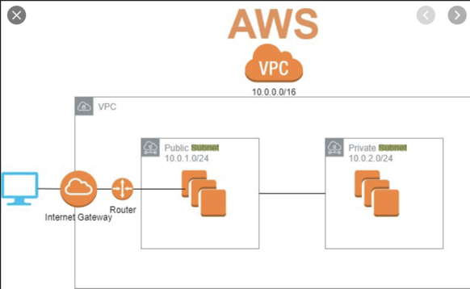
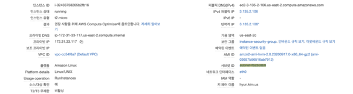
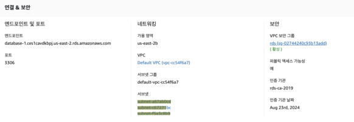
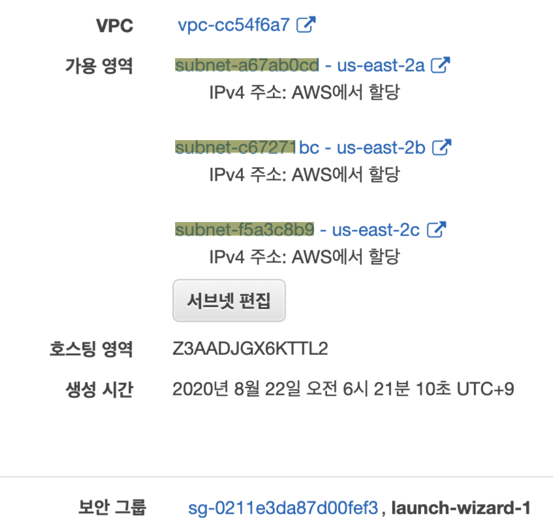
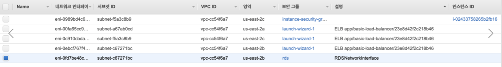
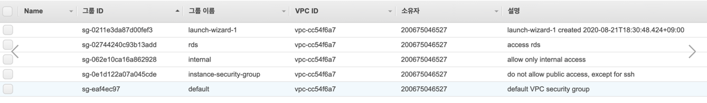

# AWS  VPC, subnet, region, AZ

VPC안에 subnet이 존재한다.

EC2, RDS
- 특정 subnet에 속해있음
- Network Interface와 연결되어 있어서, Network Interface의 IP address로 접속 가능
  EC2

RDS

ELB
- 한 VPC안에 여러개의 subnet을 생성하고, network interface도 여러개 생성됨.
- 

Network Interfaces
- 하나의 subnet에 여러 Network Interface존재 가능
- 하나의 보안 그룹 설정하여, In/Out bound 설정 가능

탄력적 IP
- Network Interface와 1:1대응(Network Interface는 탄력적 IP가 없을 수 있음
- public IP와 1:1 대응함.

보안그룹
-  VPC에 속함

Region
- 지리적 분리된 것
  Availability Zone
- isolated location within each Region
- 어떤 문제가 발생해도,  격리되어 있어서, 특정 위치의 인스턴스에 문제가 발생해도, 다른 인스턴스에 영향이 가지 않게 물리적으로 처리해둔 영역
- 분산 시스템에서는 특정 한 노드에 문제가 발생할 경우, 다른 노드들 만으로도 돌아갈 수 있게 처리를 하는데, 보통 속도를 빠르게 하기 위해, 같은 지역에 여러 노드들을 둔다. 그런데, 만약 AZ가 같으면, 한 zone에 문제가 발생할 경우, 모든 노드가 마비되어, 분산시스템 자체에 문제가 발생할 수 있다.
- 그래서, zone을 격리시켜, 한 노드가 마비되었을 때, 다른 zone의 노드에는 영향이 없게 하여, 분산 시스템이 지속적으로 유지될 수 있게 한다.